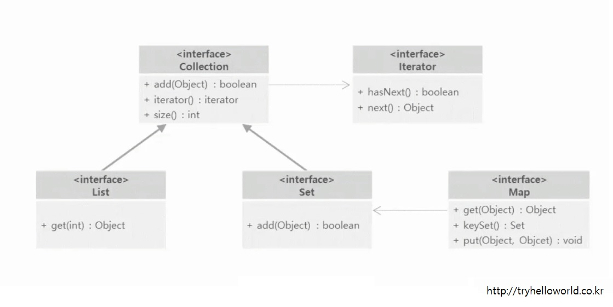

[{*}helloworld](http://tryhelloworld.co.kr/)의 자바 중급 강의를 듣고 정리한 내용이다.

## Math
- 절대값, 사인, 코사인, 탄젠트, 제곱, 랜덤등 수학 계산을 할 때 사용
- 생성자가 private이고 모든 필드와 메소드가 static이라서 Math.~로 사용

```java
// 절대값
Math.abs(-10); // 10
// 랜덤
Math.random(); // 0이상 1미만의 실수
// 더 큰값
Math.max(5, 20); // 20
```

## Generic
```java
public class Container<E> {

	private E obj;

	public E getObj() {
		return obj;
	}

	public void setObj(E obj) {
		this.obj = obj;
	}

}
```
```java
public class Test {

	public static void main(String[] args) {

		Container<Integer> con1 = new Container<>();
		con1.setObj(1);
		System.out.println(con1.getObj()); // 1

		Container<String> con2 = new Container<>();
		con2.setObj("hello");
		System.out.println(con2.getObj()); // hello

	}

}
```

## Collection
- Set인터페이스와 List인터페이스에 상속한다.
- 중복을 허용하고 자료가 저장된 순서를 기억하지 못하기 때문에 iterator() 메소드 사용
- add(), size(), iterator()등을 가짐



## Set
```java
Set<String> set = new HashSet<>();

set.add("1");
set.add("2");
set.add("3");

//set에 저장된 값 출력
for(String str : set) {
	System.out.println(str); //결과: 1, 2, 3
}

Iterator<String> iter3 = set.iterator();

while(iter3.hasNext()) {
	System.out.println(iter3.next());
}

//Map의 keySet()을 이용
Map<Integer, String> map = new HashMap<>();

map.put(1, "kim");
map.put(2, "jin");
map.put(3, "park");

Set<Integer> keys = map.keySet();

for(int i : keys) {
	System.out.println(map.get(i)); //결과: kim, jin, park
}
```

## Calendar
```java
Calendar cal = Calendar.getInstance();

//cal.add(Calendar.DAY_OF_MONTH, 150);
//주석을 풀면 현재날짜에 150일을 더한 날짜가 출력됨

int year = cal.get(Calendar.YEAR);
int month = cal.get(Calendar.MONTH) + 1;
//0~11을 가지기 때문에 1을 더해야함
int day = cal.get(Calendar.DAY_OF_MONTH);

//현재 년, 월, 일 출력
System.out.println(year + "년" + month + "월" + day + "일");
```

Java SE 8 부터 제공
```java
LocalDateTime ldt = LocalDateTime.now();
System.out.println(ldt); //2016-08-06T15:17:36.077

Month month = ldt.getMonth();
System.out.println(month); //AUGUST

System.out.println(ldt.getYear()); //2016
System.out.println(ldt.getMonthValue()); //8
System.out.println(ldt.getDayOfMonth()); //6

System.out.println(ldt.toLocalDate()); //2016-08-06
System.out.println(ldt.toLocalTime()); //15:17:04.461
System.out.println(LocalDate.of(2012, 12, 12)); //2012-12-12
System.out.println(LocalTime.of(15, 15)); //15:15
System.out.println(LocalTime.parse("15:15:30")); //15:15:30
```
